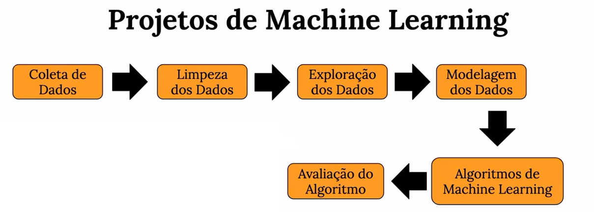

# Sobre o projeto

O projeto foi realizado com foco na criação de um modelo de Machine Learning com os dados do dataset _Tour & Travels Customer Churn Prediction_, a fim de conseguir classificar se um determinado cliente vai cancelar sua assinatura com uma empresa de viagens e passeios.  
A linguagem de programação utilizada foi o Python, as análises foram feitas utilizando principalmente as bibliotecas Pandas (para manipulação de tabelas) e Matplotlib juntamente com Seaborn (ambas para visualização de dados), além de utilizar o Sklearn para a utilização dos modelos de Machine Learning.
Depois de uma análise mais superficial, o algoritmo utilizado para o desenvolvimento do modelo de classificação foi o _Decision Tree Classifier_ (Classificador de árvore de decisão), sendo otimizado e avaliado ao longo do trabalho.

### Contexto do dataset

Uma empresa de turismo e viagens deseja prever se um cliente irá se desligar ou não com base nos indicadores fornecidos.

* Disponível em: https://www.kaggle.com/datasets/tejashvi14/tour-travels-customer-churn-prediction/code

### Esquema de inspiração

O modelo a se seguir foi baseado no seguinte esquema:

### Visualização do projeto

O projeto pode ser acessado através do arquivo 'tour_travel_customer_churn.ipynb' dentro do próprio Github ou através de IDEs que possuem suporte a arquivos '.ipynb', como o Jupyter Notebook.
